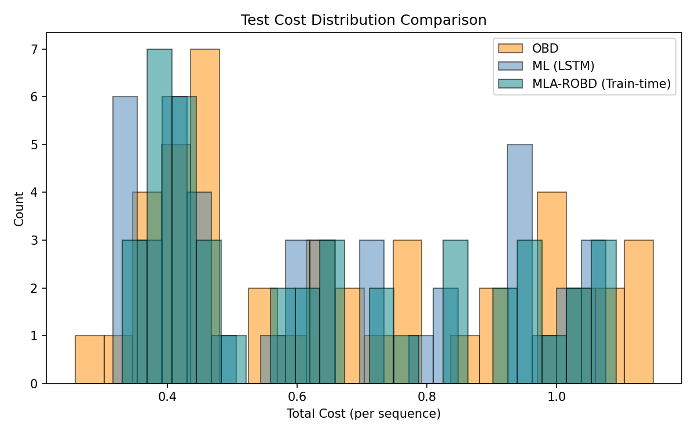
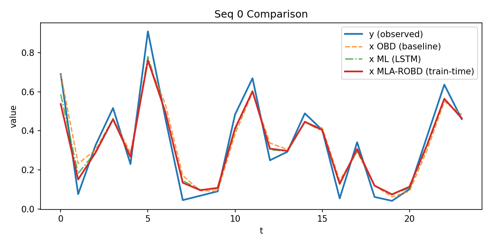

# SOCO-ROBD-ML

一个面向**平滑在线凸优化**（Smoothed Online Convex Optimization, SOCO）的实验性实现：在 AI 工作负载功率序列上，对比 R-OBD、纯 LSTM 决策，以及结合机器学习建议的 MLA-ROBD。

项目关注两个彼此制约的目标：决策 $x_t$ 应尽量贴近当前观测 $y_t$，同时避免相邻时刻的决策变化过大。评估使用的序列总成本为：

$$
C(x;y)=\frac{m}{2}\sum_{t=1}^{T}(x_t-y_t)^2
+\frac{1}{2}\sum_{t=2}^{T}(x_t-x_{t-1})^2
$$

其中第一项是 **hitting cost**，第二项是 **switching cost**，$m$ 控制二者之间的权衡。



## 实现内容

- **R-OBD 基线**：使用闭式更新在命中成本和切换成本之间做平衡。
- **自回归 LSTM**：每一步以 $[x_{t-1}, y_t]$ 为输入，直接预测当前决策 $x_t$。
- **推理期 MLA-ROBD**：先由 LSTM 给出建议，再通过 MLA-ROBD 闭式更新进行校准，无需重新训练。
- **训练期 MLA-ROBD**：将校准过程写成可微计算图，直接以校准后决策的任务成本训练模型。
- **统一评估与可视化**：输出 hitting、switching 和 total cost，并生成成本直方图及样例序列对比图。

## 数据与默认实验设置

数据文件为 [`data/AI_workload.csv`](data/AI_workload.csv)，包含 457 条按小时记录的功率数据：

| 字段 | 含义 |
| --- | --- |
| `Time (UTC)` | UTC 时间 |
| `Power (Watt)` | 功率，单位 Watt |

当前代码执行以下预处理与切分：

| 配置 | 默认值 |
| --- | ---: |
| 归一化 | 全序列 Min-Max 到 `[0, 1]` |
| 窗口长度 | 24 |
| 滑动步长 | 2 |
| 窗口总数 | 217 |
| 训练/测试切分 | 前 80% / 后 20% |
| 训练/验证切分 | 训练部分的前 90% / 后 10% |
| 最终样本数 | 155 训练 / 18 验证 / 44 测试 |
| 随机种子 | 42（NumPy、PyTorch） |

主要模型和算法参数集中在 [`main.py`](main.py) 中：

| 参数 | 默认值 |
| --- | ---: |
| 成本权重 `m` | 5.0 |
| R-OBD `λ1 / λ2` | `2 / (1 + √(1 + 4 / m)) ≈ 0.8541 / 0.0` |
| LSTM hidden size | 128 |
| LSTM layers | 2 |
| Dropout | 0.2 |
| Batch size | 64 |
| LSTM 最大训练轮数 | 180 |
| Learning rate | `7e-4` |
| Inference-time MLA-ROBD `λ1 / λ2 / λ3` | `0.5 / 0.0 / 0.25` |
| Train-time MLA-ROBD `λ1 / λ2 / λ3` | `0.5 / 0.0 / 0.25` |

## 快速开始

### 1. 创建环境

建议使用 Python 3.10 或更新版本。在项目根目录执行：

```bash
python -m venv .venv
```

Windows PowerShell：

```powershell
.\.venv\Scripts\Activate.ps1
python -m pip install --upgrade pip
python -m pip install numpy pandas matplotlib torch
```

macOS / Linux：

```bash
source .venv/bin/activate
python -m pip install --upgrade pip
python -m pip install numpy pandas matplotlib torch
```

> PyTorch 在不同平台、CUDA 版本下的安装命令可能不同；需要 GPU 支持时请按 [PyTorch 官方安装说明](https://pytorch.org/get-started/locally/) 选择对应命令。当前训练流程默认在 CPU 上运行。

### 2. 运行完整实验

```bash
python main.py
```

一次完整运行会依次：

1. 读取、归一化并切分功率序列；
2. 训练自回归 LSTM；
3. 在测试集上评估 LSTM 与 R-OBD；
4. 评估推理期 MLA-ROBD；
5. 训练并评估可微的训练期 MLA-ROBD；
6. 将数值结果和图表写入 `results/`。

训练期融合使用验证集早停，完整运行时间取决于 CPU 性能。项目目前不会保存模型检查点，因此每次执行 `main.py` 都会重新训练。

### 3. 仅重新生成图表

已有结果文本文件时，可执行：

```bash
python -c "from src.plot_results import generate_plots; generate_plots()"
```

## 结果文件

| 文件 | 内容 |
| --- | --- |
| `test_cost_hitting.txt` | 纯 LSTM 在各测试窗口上的 hitting cost |
| `test_cost_switching.txt` | 纯 LSTM 在各测试窗口上的 switching cost |
| `test_cost_total.txt` | 纯 LSTM 的 total cost |
| `test_obd_cost_total.txt` | R-OBD 基线的 total cost |
| `test_mla_robd_inference_cost_total.txt` | 推理期 MLA-ROBD 的 total cost |
| `test_mla_robd_trainfusion_cost_total.txt` | 训练期 MLA-ROBD 的 total cost |
| `seq_*_y.txt` | 样例窗口的观测序列 |
| `seq_*_x_*.txt` | 不同方法在样例窗口上的决策序列 |
| `test_*comparison.png`、`test_*hist.png` | 对比图与成本分布图 |

仓库中现有结果快照的测试集统计如下（44 个窗口，数值越低越好）：

| 方法 | Mean total cost | Median total cost |
| --- | ---: | ---: |
| R-OBD | 0.670919 | 0.629077 |
| LSTM | **0.628300** | 0.601466 |
| MLA-ROBD（训练期融合） | 0.644577 | **0.601000** |

这些数值用于说明当前代码与结果文件的对应关系，不代表跨数据集的通用结论。即使设置了随机种子，不同 PyTorch、BLAS 或硬件环境下的训练结果仍可能略有差异。



## 项目结构

```text
.
├── data/
│   └── AI_workload.csv       # 原始功率序列
├── results/                  # 数值结果与图表
├── src/
│   ├── preprocess.py         # 数据读取、归一化、滑窗
│   ├── robd.py               # R-OBD 基线与成本函数
│   ├── ml_model.py           # LSTM 模型
│   ├── train.py              # 自回归训练与任务损失
│   ├── evaluate.py           # 推理与 NumPy 评估
│   ├── hybrid.py             # MLA-ROBD 校准及训练期融合
│   └── plot_results.py       # 结果可视化
└── main.py                   # 完整实验入口
```

## 使用自定义数据

1. 准备至少两列的 CSV 文件；当前实现读取**第二列**作为数值序列。
2. 将文件放入 `data/`，并修改 `main.py` 中的 `data_path`。
3. 根据数据采样频率调整 `window_size` 和 `step`。
4. 如需改变成本偏好或融合强度，修改 `m`、`la1_*`、`la2_*` 和 `la3_*`。

当前实现先对完整序列归一化和构造重叠窗口，再按时间顺序切分数据。若用于严格的时序泛化评估，建议先切分原始时间序列，再分别归一化、构窗，避免相邻数据集之间共享时间点。
